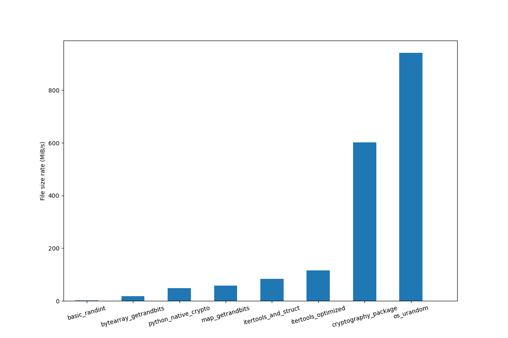

# Random Binary Files Generator

## Synopsis

This software is designed to generate lots of random binary files (GB to TB). It is useful in protect private data when sell or discard old devices with storage. 

This software provides lots of different methods to generate them, and includes a benchmark for their performance.

## Requirements

Most methods just rely on basic python package. This requirement also mark special basic packages such as `os`, which may not work in special cases.

|   Method |  Packages relied |
|  ----  | ----  |
| `basic_randint`  | None |
| `bytearray_getrandbits`  | None |
| `map_getrandbits`  | None |
| `os_urandom`  | `os` |
| `itertools_and_struct`  | None |
| `itertools_optimized`  | None |
| `python_native_crypto`  | None |
| `cryptography_package`  | `cryptography_package` |


## Usages

First clone the repo:

```shell script
git clone https://github.com/liushiyu1994/random_binary_file
```

Switch to the source direct, configure the settings in `config.py`, and run main script:

```shell script
python main.py
```

If you want to do benchmark by yourself, just run benchmark script:

```shell script
python benchmark.py
```

### List of Methods

|   Method Name |  Description |
|  ----  | ----  |
| `basic_randint`  | Use `random.randint` function to generate integers between 0-255 and use `b"".join` to merge them. |
| `bytearray_getrandbits`  | Use `random.getrandbits` function to generate integers with 8 bits and use loop and `bytearray` to merge them. |
| `map_getrandbits`  | Use `random.getrandbits` function to generate integers between 0-255 and use `map` and `bytearray` to merge them. |
| `os_urandom`  | Use `os.urandom` function to generate random bytes and use `bytearray` to merge them. |
| `itertools_and_struct`  | Use `random.getrandbits` function to generate integers between 0-255 and use `map` and `struct` to pack them together. |
| `itertools_optimized`  | Optimize `itertools_and_struct` to suitable for large volume of random bytes. |
| `python_native_crypto`  | Use `os.urandom` function to generate random seed, and use hash method to generate following random bytes from zero byte stream. |
| `cryptography_package`  | Use `os.urandom` function to generate random key, and use AES to encrypt zero byte stream. |

## Benchmark Result

Benchmark is done based on default parameters in `config.py`. 



## Contributors

**Shiyu Liu**

+ [http://github.com/liushiyu1994](http://github.com/liushiyu1994)

## License

This software is released under the [MIT License](LICENSE-MIT).
